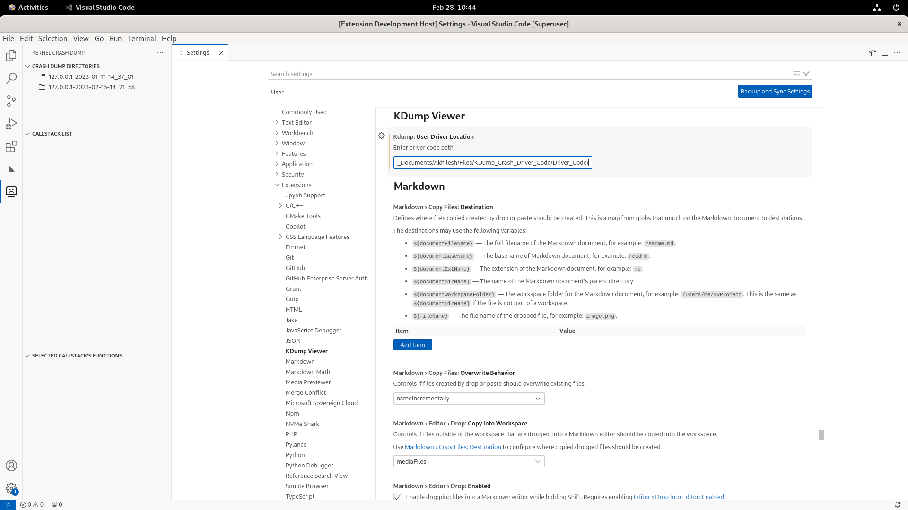
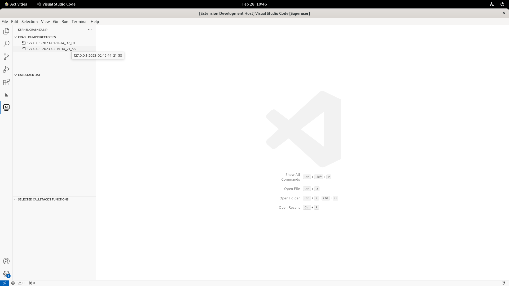
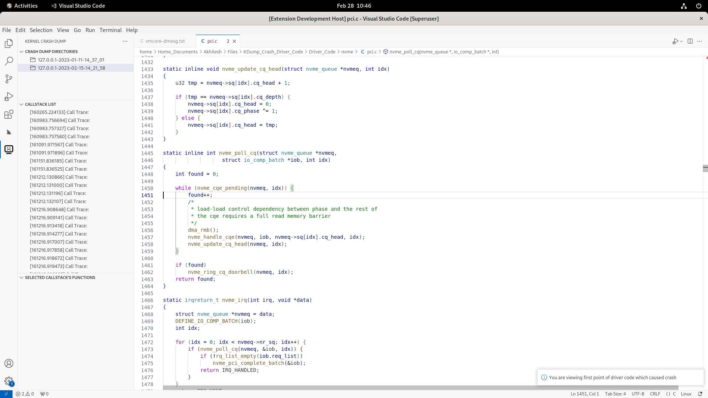
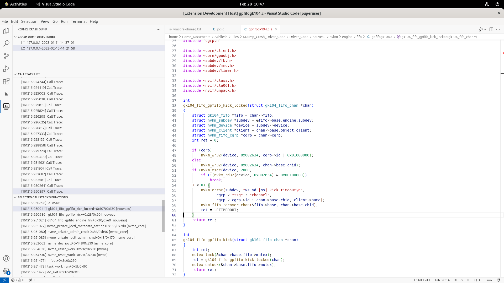

# KDump Viewer for Visual Studio Code

Welcome to the `KDump Viewer` extension for VS Code. This extension provides the following features:

- Open Kernel crash dump (vmcore) of selected "/var/crash" directory
- See exact driver source code line that caused the crash
- Traverse through all Call Traces of currently selected dump
- Reach driver source code of function mentioned in a particular Call Trace

## Prerequisites

- The extension is only compatible with Linux-based systems
- Require VS Code version 1.46.0 or higher
- User should input directory path containg driver source code and driver binary (.ko)
- User should group each driver and its code in one sub-directory
- Eg., 
    directory: "/root/KDump/"
    nvme driver: "/root/KDump/nvme/" -> contains nvme.ko, nvme-core.ko and all nvme code files
    nouveau: "/root/KDump/nouveau/" -> contains nouveau.ko and all nouveau code files

## Usage
- Go to`Settings` → `Extensions` → `KDump Viewer`
- In above settings, enter directory containing driver source code and driver binary (.ko)
- Click on `Kernel Crash Dump` activity bar icon
- From `Crash Dump Directories` view, select your dump directory
- vmcore-dmesg.txt of the selected dump directory will open in your VS Code with file pointer at latest Call Trace
- Exact driver code line that caused the crash will open in your VS Code in other tab
- `Callstack List` view will be refreshed with Call Traces of selected directory's vmcore dump
- From `Callstack List` view, select the call trace for whose functions you wish to see in `Selected Callstack's Functions` view
- `Selected Callstack's Functions` view will be refreshed with driver function names of selected call trace
- Click on any function in `Selected Callstack's Functions` view to open source code of that driver function 

## Screenshots

### 1.0 Example of expected Driver Code Directory Structure 

#### 1.1 Example of expected Nouveau Driver Code Directory Structure 

### 2. Extension Settings Page

### 3. Crash Directory panel
- First Click on the extension icon will list directories inside /var/crash

### 4. Callstack List panel
- Clicking on any directory from previous panel will show its Call Traces clubbed together in CallStack List panel
- It will open its vmcore-dmesg.txt in new tab and the suspected crash point of file and line number found from first RIP using gdb

### 5. Selected Callstack's Functions panel
- Clicking on any Call Trace from Callstack List panel will update Selected Callstack's Functions panel showing functions of that call trace

### 6. See driver code
- Clicking on any function from Callstack's Functions panel will show its driver code in a new tab
- This functionality require correct driver source code in extension settings

